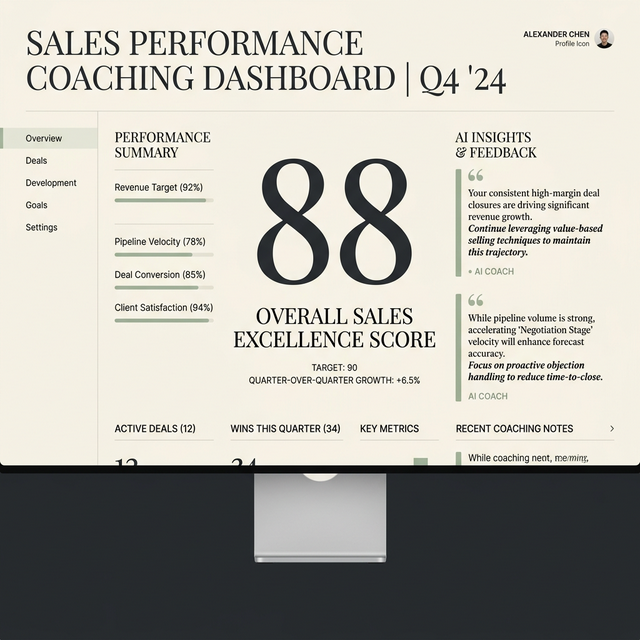

# Visual Design Research Brief — The Certainty System

This document outlines research findings and design inspiration for The Certainty System, focusing on a premium, warm light mode aesthetic that integrates "MA" principles, confident typography, tasteful gamification, and surgical glassmorphism.

---

## 1. Dashboard Design — Warm, Expressive, Light Mode

The goal is to move away from clinical, stark #FFFFFF backgrounds and thin gray borders, opting instead for soft neutrals (#F4F6F8 or #F9FAFB) with subtle warm accents to create an inviting, premium feel.

*   **Linear (Design System)**
    *   **Where to find it:** linear.app or their design docs
    *   **Why steal this:** Linear is the gold standard for "precision and density." Even in light mode, their use of subtle off-whites for backgrounds, paired with incredibly tight and intentional spacing, creates a professional, "quiet" dashboard that feels like a high-end tool rather than generic SaaS. 
    *   **Caveats:** Linear trends towards a cooler/neutral aesthetic; you will need to inject warmer cream/off-white tones into their structural model.
*   **Craft.do**
    *   **Where to find it:** craft.do (product structure and UI)
    *   **Why steal this:** Craft excels at premium light mode. They use warm, subtle drop shadows, slightly rounded corners, and a creamy canvas that feels like high-quality paper. Their use of color is deliberate—mostly monochrome with vibrant accents only for interactive or active states.
*   **Family App**
    *   **Where to find it:** family.co or Mobbin (iOS)
    *   **Why steal this:** Family uses a very distinctive, warm, almost tactile interface. It doesn't look like anything else. It utilizes soft gradients and a card-based architecture that feels substantial without being heavy.

> [!TIP]
> **Avoid:** "Corporate Blue" or flat white canvases. Use a base of warm gray/cream, and let the data/accents provide the color hierarchy.

---

## 2. Gamification Done Tastefully

Tasteful gamification avoids the "kindergarten gold star" trap by focusing on *earned progression* and *meaningful status* rather than cheap dopamine hits.

*   **Oura Ring / Apple Fitness (Achievement Philosophy)**
    *   **Where to find it:** ouraring.com or Apple Fitness app
    *   **Why steal this:** When you hit a goal in Apple Fitness, the ring completes cleanly. When you earn a special badge, it's rendered as a physical object (like an enameled pin) rather than a flat vector illustration. *The technique to steal is treating digital achievements like physical artifacts.* They should have weight, lighting, and texture.
*   **Duolingo (When to hold back)**
    *   **Why look at this:** Look at Duolingo to see what *not* to do for a professional sales platform. Their gamification is brilliant for education, but the loud colors, constant mascots, and hyper-active animations will feel patronizing to sales professionals.
    *   **The pivot:** Instead of a cartoon owl, think of unlocking a new "tier" of a premium credit card. The aesthetic should be understated. Black, gold, silver, bronze—rendered with high-fidelity gradients or glass—rather than neon green and pink.

---

## 3. Japanese-Influenced Product Design (MA Principle)

"Ma" (間) translates to space or pause. It's not just "white space"; it's the intentional emptiness that gives meaning to the elements around it.

*   **Cron (now Notion Calendar)**
    *   **Where to find it:** cron.com (or its archives/Mobbin)
    *   **Why steal this:** Cron was famous for its obsessive attention to spacing. It breathed. The UI didn't use lines to separate everything; it used *distance*. By relying on 'Ma', the interface felt incredibly fast and lightweight.
    *   **Technique:** Remove as many dividing lines as possible. Use macro negative space (large gaps between major sections) to group content logically. Let the content create the structure.
*   **Aman Resorts (Aesthetic benchmark)**
    *   **Where to find it:** aman.com
    *   **Why steal this:** While not a SaaS app, look at how Aman uses typography and massive amounts of negative space to convey absolute luxury. A performance dashboard that uses this level of breathing room immediately signals "premium coaching" rather than "data dump."

---

## 4. Typography Hierarchies That Feel Confident

Confident hierarchy means the user knows exactly what to look at instantly, without relying on color alone.

*   **Things 3**
    *   **Where to find it:** culturedcode.com/things
    *   **Why steal this:** Things 3 has arguably the most mature typographic hierarchy in software. They use a strict system of font sizes and weights (typically a clean sans-serif like San Francisco or Inter) to guide the eye. The bold headings have significant weight, while supporting text is small but legible (excellent contrast). 
*   **Superhuman**
    *   **Where to find it:** superhuman.com
    *   **Why steal this:** Superhuman relies heavily on typography to create its "composable interface." They use custom letter-spacing (tracking) for small caps and micro-copy to make it incredibly legible, while primary actions use confident, thicker weights.

> [!IMPORTANT]
> **The Move:** Choose one highly versatile, premium geometric sans-serif (like *Outfit*, *Plus Jakarta Sans*, or *Inter* tightly tracked). Use massive size and weight contrasts. A score should be huge and bold (e.g., 64px, Black weight); the label underneath should be tiny and muted (e.g., 12px, Regular, Medium Gray).

---

## 5. Score / Progress Visualization

Numbers need to feel meaningful. Motion and physics are critical here.

*   **Apple Fitness Rings (The Gold Standard)**
    *   **Why steal this:** The physical feeling of the Apple ring closing—the way the lead edge overlaps the tail when over 100%—is the standard. It uses a gradient that shifts as it circles, giving it a 3D volume.
    *   **Adaptation for The Certainty System:** Instead of standard "fitness" colors, use a premium palette tailored to light mode. A ring that starts as a warm taupe and fills with a rich, vibrant brand color (like a deep terracotta or sophisticated teal) as the score increases.
    *   **Motion:** Use spring physics (framer-motion is ideal here). When a user opens their dashboard, the score shouldn't just "appear" or linearly slide up. It should spring into place with weight and momentum.

---

## 6. AI Coaching / Feedback Interfaces

The best embedded AI doesn't look like a standard chat window slapped onto the side of a screen.

*   **ChatPRD & Notion AI (Embedded Context)**
    *   **Where to find it:** chatprd.ai / notion.so
    *   **Why steal this:** The AI feels like an *editor* or a *coach* looking over your shoulder, not a separate chat room. The UI is integrated directly into the workflow.
    *   **The Technique:** Instead of a generic chat bubble, use context-aware "insight cards." If the AI is scoring a call, the feedback should appear adjacent to the specific moment in the call timeline, perhaps utilizing a subtle glowing border or a slight "lift" (drop shadow) to indicate it's generated intel, rather than static data.

---

## 7. Glassmorphism Done Right (Surgical Use)

Glassmorphism (background blurring, translucent panels) is often overused, making UIs muddy and hard to read. Tasteful use is restricted to moments of overlap or achievement.

*   **macOS Big Sur / VisionOS paradigms**
    *   **Why steal this:** Apple uses "Liquid Glass" to establish depth. The frosted glass effect is used *only* when something is floating above the primary layer (like a dropdown, a modal, or an achievement pop-up)—never for standard data cards.
*   **Bento UI with Glass Accents**
    *   **The Technique:** The dashboard is a clean, solid Bento grid on a warm background. *However*, when a user earns a badge or hits a personal best, that specific card transforms, taking on a glassmorphic surface that floats slightly higher than the rest of the grid, casting a soft shadow. This makes the achievement feel physically distinct from the routine data.

---

## 💡 Top 3 Recommended Design Directions

Based on this research, here are three distinct, actionable design approaches to rapidly prototype for The Certainty System:

### Direction 1: The "Editorial Coach" (Focus: Typography & MA)

> 

*   **Vibe:** Feels like a high-end magazine or a bespoke consulting report. Highly intellectual and calm.
*   **Palette:** Warm cream background (#FDFBF7), deep charcoal for primary text (#1A1A1A), with a single, sophisticated accent color (e.g., a muted sage green or burnt orange).
*   **Key Moves:** Massive typography for scores. Almost zero borders or lines separating cards—relying entirely on wide margins (MA). AI feedback is presented like editorial pull-quotes with elegant serif accents.

### Direction 2: The "Tactile FinTech" (Focus: Bento Grid & Surgical Glass)

> 

*   **Vibe:** Feels like a premium modern banking app (think Monzo or Stripe's highest-end tiers). Trustworthy, actionable, and structured.
*   **Palette:** Slightly cooler off-white canvas (#F4F5F7) with stark white (#FFFFFF) data cards. High-contrast black text.
*   **Key Moves:** A strict Bento-box layout. Every card has a very subtle, tight drop shadow. Glassmorphism is used *only* for the sticky header and for the "Level Up" modal overlays to create a sense of looking through a lens at your progress.

### Direction 3: The "Dynamic Physical" (Focus: Motion & Badging)

> 

*   **Vibe:** Feels alive and rewarding. The interface breathes and reacts specifically to user input.
*   **Palette:** Warm gray background with vibrant, gradient-filled progress elements that pop against the neutral base.
*   **Key Moves:** Heavy use of spring physics for all interactions. The progress rings are thick and use rich gradients. Badges are rendered as high-fidelity 3D metallic objects that rotate slightly on hover. This is the most "gamified" approach but keeps it premium through high production value of the assets.
